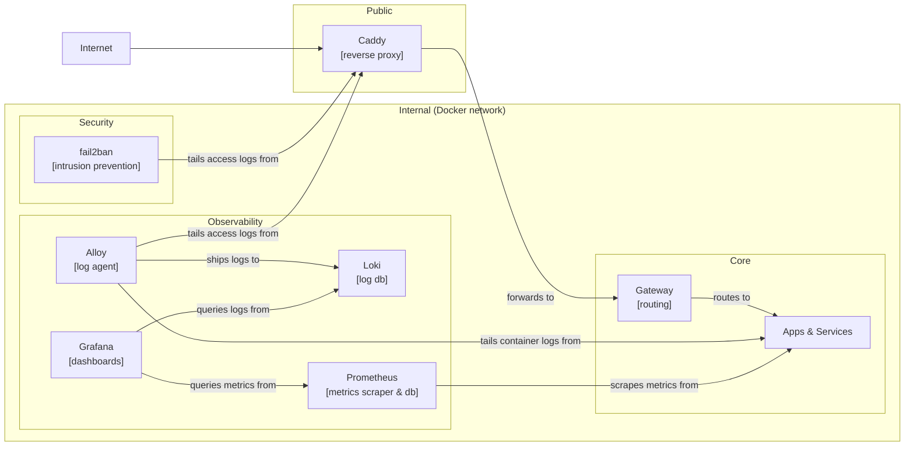

# shipyard

Infrastructure-as-code for my single-host, self-hosted stack (Docker Compose + Caddy).

The setup is opinionated, yet the entrypoints and configuration are intended to be clear and easy to
adapt.

## Contents

- [Architecture](#architecture)
- [Components](#components)
- [Prerequisites](#prerequisites)
- [Quickstart](#quickstart)
- [Configuration](#configuration)
- [Operations](#operations)
- [Minimal security notes](#minimal-security-notes)

**What you get**

- HTTPS at the edge (Caddy + Let’s Encrypt)
- Central routing (Spring Cloud Gateway)
- Observability (Alloy + Loki + Prometheus + Grafana)
- Basic hardening (security headers, rate limiting, fail2ban)

## Architecture

Request path: `Internet → Caddy (TLS termination) → Gateway (routing) → Apps`



## Components

- **Caddy**: HTTPS, rate limiting, security headers, reverse proxy to `Gateway`.
- **Gateway**: Spring Cloud Gateway (separate repo: [`apigw`](https://github.com/dario-mr/apigw))
  that routes to upstream apps.
- **fail2ban**: tails Caddy logs and bans offenders at firewall level.
- **Watchtower**: auto-pulls the latest Docker images.
- **Portainer**: Docker UI, served under `/portainer/`.
- **Observability**:
    - **Alloy**: tails access logs (from Caddy log file) and application logs (from Docker stdout)
      and ships them to Loki.
    - **Loki**: log database.
    - **Prometheus**: scrapes and stores metrics from Spring Boot apps and infra services.
    - **Grafana**: dashboards for logs (Loki) and metrics (Prometheus), served under `/grafana/`.
- **Backends**: `api-stress-test`, `ichiro-family-tree`, etc.

## Prerequisites

- A domain name pointing to the server’s IP (for TLS/Let’s Encrypt).
- A server with Docker and Docker Compose (Compose v2).
- Firewall allows inbound `80/tcp` and `443/tcp`.
- If you enable Matrix + Coturn (private chat and calls), you also need `3478/tcp`, `3478/udp`, and
  a UDP port range (see `DOCUMENTATION.md`).

## Quickstart

```sh
# 1) (Optional) Configure Docker log rotation (requires sudo + jq)
./scripts/setup-docker-logging.sh

# 2) Create your env file
cp .env.example .env
# edit values

# 3) Start
docker compose up -d --build

# 4) Verify
docker compose ps
docker compose logs -f caddy
```

**Access (after DNS + TLS are working)**

- Grafana: `https://<your-domain>/grafana/`
- Portainer: `https://<your-domain>/portainer/`

## Configuration

- `.env` contains runtime configuration and secrets. Start from `.env.example`.
- Treat these as secrets and do not commit them:
    - `GRAFANA_ADMIN_PASSWORD`
    - `EMAIL_SERVER_PASSWORD` (Watchtower notifications)
    - `DB_PASSWORD`, `OAUTH_CLIENT_SECRET`, `ENCRYPTION_KEY`
    - `CONDUIT_REGISTRATION_TOKEN`, `TURN_SECRET`
- Common configs:
    - `DOMAIN`, `TIMEZONE`
    - DB / OAuth settings for your apps

## Operations

See [Operations & troubleshooting](DOCUMENTATION.md#operations--troubleshooting) for
service-specific notes.

## Backups

This stack uses named Docker volumes (see `docker-compose.yml`). If you care about persistence, back
up at least:

- `caddy_data`, `caddy_config`
- `grafana_data`, `prometheus_data`, `loki_data`
- `portainer_data`
- `conduit-data` (only if you enable Matrix)

## Minimal security notes

This stack is meant to be exposed to the public internet.

- Caddy terminates TLS and applies basic hardening (headers + rate limiting).
- fail2ban bans abusive IPs based on Caddy logs.
- You should still review configs, rotate secrets, and keep images updated before running this on a
  real domain.
