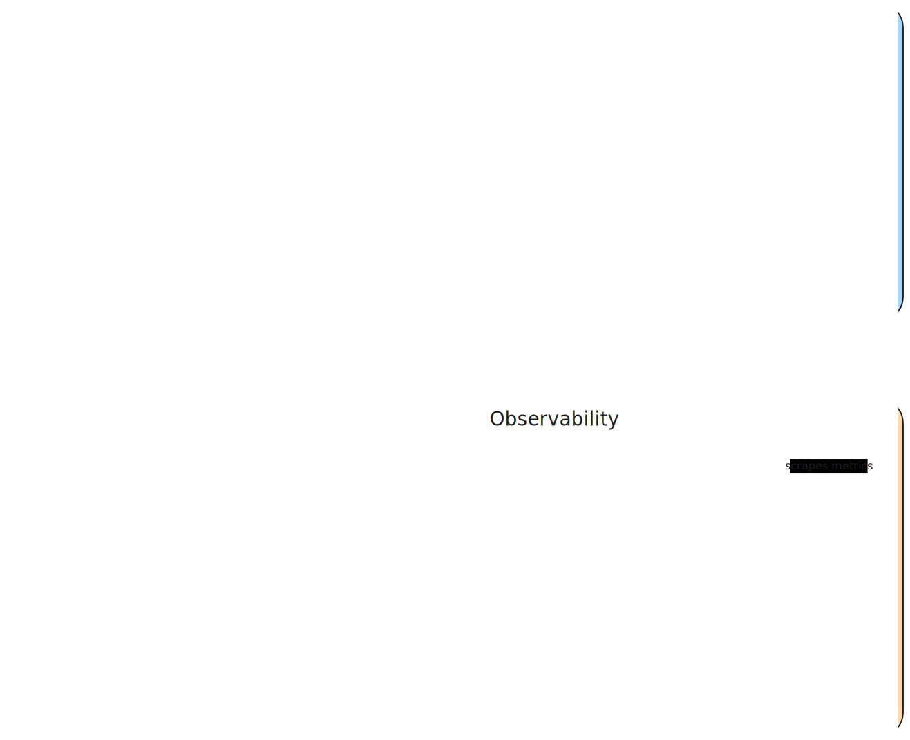

# shipyard

Infrastructure-as-code for my self-hosted stack (Docker Compose + Caddy).

Caddy reverse proxy at the edge, Spring Cloud Gateway in the middle, observability and hardening
around it.

## Architecture



## Components

- **Caddy**: HTTPS, rate limiting, security headers, reverse proxy to `Gateway`.
- **Gateway**: Spring Cloud Gateway (separate repo: [apigw](https://github.com/dario-mr/apigw)) that
  routes to upstream apps.
- **fail2ban**: tails Caddy logs and bans offenders at firewall level.
- **Watchtower**: auto-pull the latest docker images.
- **Portainer**: Docker UI, served under `/portainer/`.
- **Observability**:
    - **Alloy**: tails access logs (from Caddy log file) and application logs (from docker
      stdout) and ships them to Loki.
    - **Loki**: log database.
    - **Prometheus**: scrapes and stores metrics from:
        - Spring Boot apps
        - Prometheus itself, Loki, and Alloy
    - **Grafana**: dashboards for **logs** (Loki) and **metrics** (Prometheus), served under
      `/grafana/`.
- **Backends**: `api-stress-test`, `ichiro-family-tree`, etc.

## Pre-requisites

- A domain name pointing to the server's IP (for TLS/Let’s Encrypt).
- A server with Docker and Docker Compose installed.

## How to run

```shell
# 1. (Optional) Setup docker logging driver to use json-file with log rotation
./scripts/setup-docker-logging.sh

# 2. Copy & edit env file
cp .env.example .env
# edit values

# 3. Bring the stack up
docker compose up -d --build

# 4. Verify
docker compose ps
docker compose logs -f caddy
```

More documentation in [DOCUMENTATION.md](DOCUMENTATION.md).